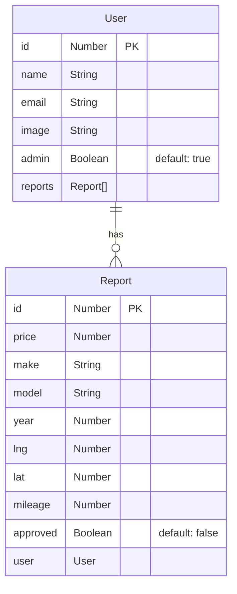

## 簡介

這是一個使用 NestJS、TypeORM 和 SQLite 資料庫建立的範例專案，主要目的是展示如何使用 NestJS 實現使用者權限管理和報表管理 API。

## 安裝

本專案使用 docker-compose.yaml 啟動，請確保主機有 docker 環境，如果是 Linux 環境則需要另外安裝 docker-compose 套件。而如果是 Windows、Mac 則只需要安裝 Docker Desktop 即可。

要安裝此專案，請按照以下步驟進行：

1. clone 此專案：`git clone https://github.com/nest-car-value.git`
2. 切換到專案目錄：`cd nest-car-value`
3. 安裝相依套件：`docker compose up -d`

## 使用環境及工具
- Node.js v16.17.0
- NestJS v9.0.0
- TypeORM v0.3.12
- SQLite3 v5.1.6

## Restful API
### 使用者 (users)
| Method | API | 備註 |
|---|---|---|
| `GET` | /auth/currentUser | 取得目前登入使用者的資訊 |
| `GET` | /auth | 取得所有使用者資訊 |
| `GET` | /auth/:id | 取得指定 ID 的使用者資訊 |
| `POST` | /auth/signout | 登出 |
| `POST` | /auth/signup | 註冊 |
| `POST` | /auth/signin | 登入 |
| `DELETE` | /auth/:id | 刪除指定 ID 的使用者 |
| `PATCH` | /auth/:id | 修改指定 ID 的使用者資訊 |
### 報告 (reports)
| Method | API | 備註 |
|---|---|---|
| `GET` | /reports | 取得所有報告 |
| `POST` | /reports | 新增報告 |
| `PATCH` | /reports/:id | 修改指定 ID 的報告資訊 |

### 資料庫結構圖



## 資料夾結構圖

```
├── app.controller.spec.ts
├── app.controller.ts
├── app.module.ts
├── app.service.ts
├── config
│   └── typeorm.config.ts
├── data-source.ts
├── guards
│   ├── admin.guard.ts
│   └── auth.guard.ts
├── interceptors
│   └── serialize.interceptor.ts
├── main.ts
├── migrations
│   └── 1679411878532-initial-schema.ts
├── reports
│   ├── dtos
│   │   ├── approve-report.dto.ts
│   │   ├── create-report.dto.ts
│   │   ├── get-estimate.dto.ts
│   │   └── report.dto.ts
│   ├── reports.controller.spec.ts
│   ├── reports.controller.ts
│   ├── reports.entity.ts
│   ├── reports.module.ts
│   ├── reports.service.spec.ts
│   ├── reports.service.ts
│   └── requests.http
└── users
    ├── auth.service.ts
    ├── decorator
    │   └── current-user.decorator.ts
    ├── dtos
    │   ├── create-user.dto.ts
    │   ├── update-user.dto.ts
    │   └── user.dto.ts
    ├── interceptors
    │   └── current-user.interceptor.ts
    ├── middlewares
    │   └── current-user.middleware.ts
    ├── requests.http
    ├── users.controller.spec.ts
    ├── users.controller.ts
    ├── users.entity.ts
    ├── users.module.ts
    ├── users.service.spec.ts
    └── users.service
```

## 作者
藍奕欣
[Github](https://github.com/ysl0628)<br>
LinkedIn: [藍奕欣](https://www.linkedin.com/in/奕欣-藍-100371248/)<br>
Email: yihsinlan@gmail.com
